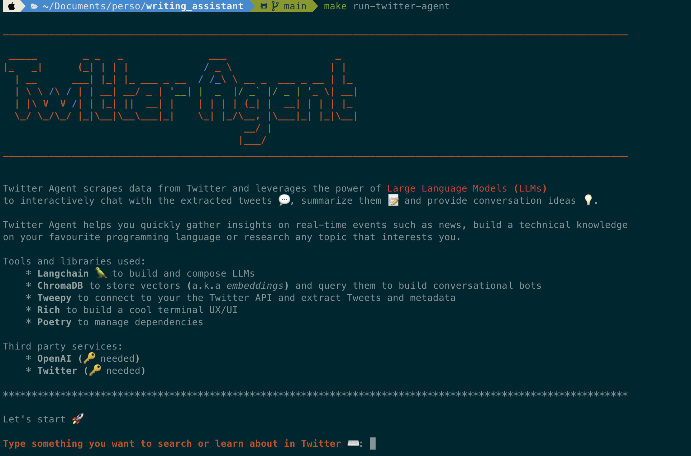

## Twitter Agent 

I'm always looking for tools to digest the news and provide ideas. So I built one.



Twitter Agent scrapes data from Twitter and leverages the power of Large Language Models (LLMs) to interactively chat with the extracted tweets 💬, summarize them 📝 and provide conversation ideas 💡.

Twitter Agent helps you quickly gather insights on real-time events such as news, build a technical knowledge
on your favourite programming language or research any topic that interests you.

### Functionalities

- Scrapes tweets on your behalf either from a list of 
user accounts or a list of keywords.
- Embeds the tweets using OpenAI 
- Indexes the embeddings (i.e. *vectors*) in ChromaDB
- Enriches the index with additional metadata
- Creates a summary of the tweets and provides  potential questions to answer
- Opens a chat session on top of the tweets
- Saves the conversation with its metadata
- A rich terminal UI and logging features


### Tools and libraries used

* **Langchain** 🦜 to build and compose LLMs
* **ChromaDB** to store vectors (a.k.a embeddings) and query them to build conversational bots
* **Tweepy** to connect to your the Twitter API and extract Tweets and metadata
* **Rich** to build a cool terminal UX/UI
* **Poetry** to manage dependencies

### Third party services
* OpenAI (🔑 needed)
* Twitter (🔑 needed)

### Run the app locally

* Install dependencies with poetry

poetry install --with dev

* Add API credentials

Create .env file at the root of the project with the following keys:

```
OPENAI_API_KEY=<OPENAI KEY>
TWITTER_API_KEY=<TWITTER API KEY>
TWITTER_API_KEY_SECRET=<TWITTER API KEY SECRET>
TWITTER_BEARER_TOKEN=<TWITTER BEARER TOKEN>
```

More info on these credentials [here](https://openai.com/) and [here](https://developer.twitter.com/en/docs/apps/overview).


### Future features:

This is an on-going project, so feel free to contribute:

Here's what I plan in the near future:

* support other LLMs (Falcon?)
* support Pinecone as an alternative to ChromaDB
* support Twint as an alternative to Tweepy (in case the Twitter API reaches its limit in terms of calls)
* add instructions to deployment on a cloud infrastructure
* improve the prompts to have a more engaging/enriching conversations
* add actions to open URLs and fetch content from it